# 井字棋(Tic-Tac-Toe)

井字棋(Tic-Tac-Toe) [^tic-tac-toe] 游戏是 两位玩家在三乘三的格子中行棋，成功在水平、垂直或对角线上使三子连成一线的玩家获得胜利。如果双方都发挥的最好，正常来说该游戏一般都为平局。

## 强化学习

### 机器学习

通过某种方法，来找到一个函数满足 $y = f(x)$，其中 $x, y$ 分别表示数据和标注，$f$ 是需要找到函数，一般来说数据和标注是全体可能样本中的一小部分，我们 **期望** 得到的函数是，对于任意 $\hat x, \hat y$ 都有 $\hat{y} = f(\hat{x})$。

如下图所示，强化学习 [^ml] 是机器学习的一种，一般可以描述成如下形式：

智能体 处于一种 环境 中，通过采取一系列的 动作 来获得环境状态的改变和获得反馈。通过不断地探索不同动作对环境的影响和获得的反馈。使得智能体能够得到更好的结果，这个过程就是强化学习 (Reinforcement Learning)。

## 探索和利用

最大化奖赏需要考虑两方面，一是了解每个动作带来的奖赏，二是执行最大奖赏的分数。其中获得不同动作带来的奖赏叫做 探索（Exploration），而执行最大奖赏分数的动作叫做 利用(Exploitation)，而我们的目标是 **最大化最终的奖赏** 或者 **最小化最终的惩罚**。

这就好比我们要去一个荒原挖矿，我们的目标是挖到最多的矿。具体的做法是，首先我们需要探索这个荒原矿藏的位置，确定要在什么地方挖掘，这个过程就是探索；其次我们需要去挖掘矿藏含量最高的矿，进而得到更多的矿。这里有一个矛盾，一方面我们可能无法或者很难探索荒原的每一个角落，每次探索都需要成本；另一方面，如果结束探索直接挖掘，我们可能没有找到最多的矿，另外更多的探索也不一定能够找到含量更高的矿，所以有很多碰运气的成分，于是我们必须要在 探索和利用之间达到一种平衡。

## $\varepsilon$ 贪心算法

$\varepsilon$ 贪心算法，每次尝试时，以一定的概率 $\varepsilon$ 进行探索，在动作空间中随机地执行一个动作；以 $1 - \varepsilon$ 的概率进行利用或者发掘，即执行记录中奖赏最高的动作。对于井字棋来说，形式化可表示为：

设 $a$ 为动作，执行 $n$ 此得到的奖励为 $v_1, v_2, \cdots, v_n$ ，平均奖励 $Q(a)$ 为：

$$
Q(a) = {1 \over n}\sum_{i = 1}^n v_i
$$

若根据上式记录平均奖赏，则需要记录 $n$ 个奖赏值，更高效的做法是对均值进行增量式计算；

初始时: $Q_0(a) = 0$，对于任意 $n \geqslant 1$，第 $n - 1$ 次的奖励记为 $Q_{n - 1}(a)$，则第 $n$ 次尝试获得奖赏 $v_n$ 之后，平均奖赏为：

$$
Q_n(k) = {1 \over n}[(n - 1) Q_{n - 1}(a) + v_n]
$$

## 井字棋

对于井字棋，其状态空间（动作空间）有限，我们可以直接使用穷举法来探索每种动作获胜的概率。

如前所述，我们从机器学习的角度来重新思考这个问题，我们需要找到一个函数 $y = f(x)$，就必须明确输入，输出，函数 $x,y,f$ 分别是什么。对于强化学习来说，**输入**是环境的状态 (State, s) 和 此状态下所执行的动作 (Action, a)，**输出**是该动作所能的**奖励**或者反馈 (Reward, r)。奖励必须以一种形式量化，通常可以表示成为某种分数，分数越高说明奖励越丰厚。而函数 $f$ 是一种抽象函数，用于记录输入和输出的对应关系，可能无法用基本初等函数来表示。这里 $y = f(s, a)$。

- 蒙特卡洛法

## References 

[^tic-tac-toe]: https://en.wikipedia.org/wiki/Tic-tac-toe
[^ml]: 周志华. 机器学习[M]. 清华大学出版社 出版年 2016-1-1, 2016
